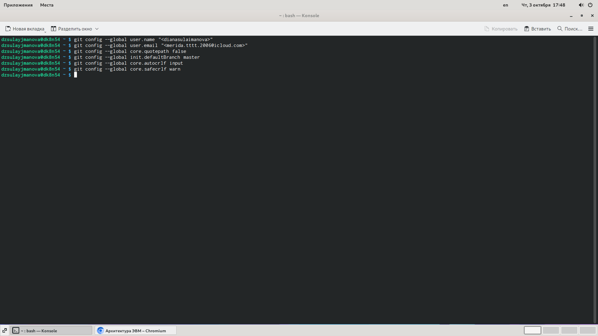
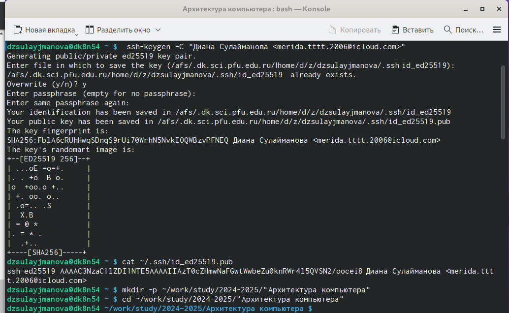
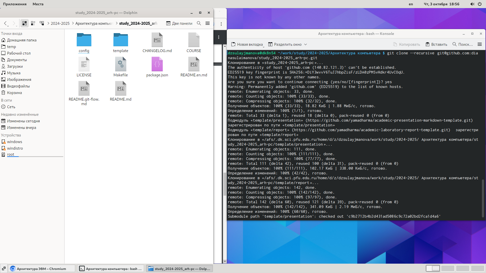
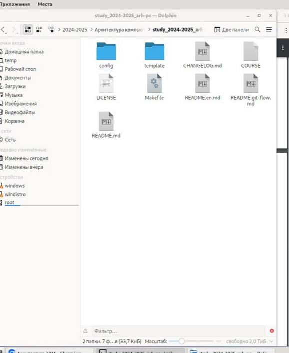
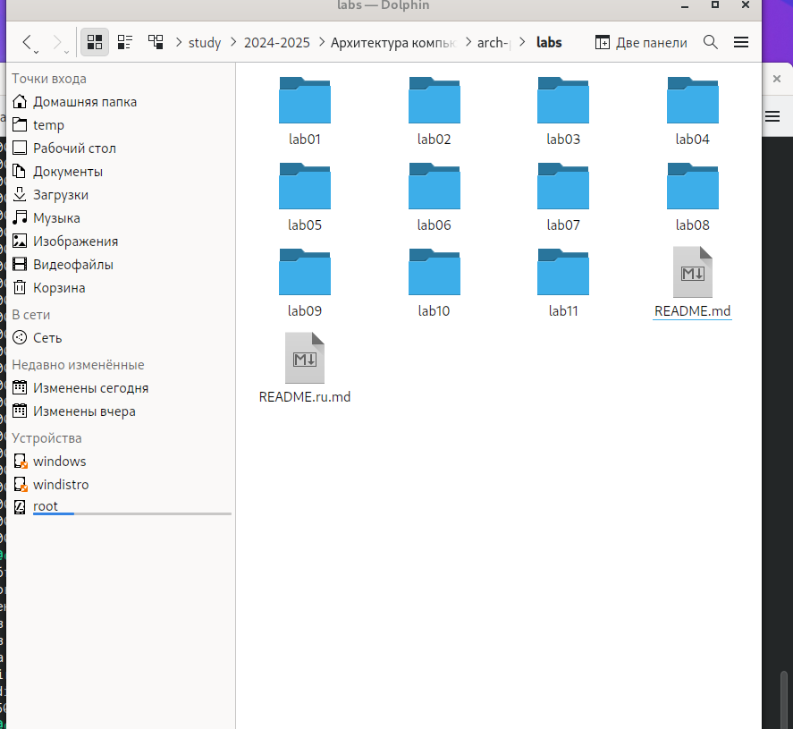
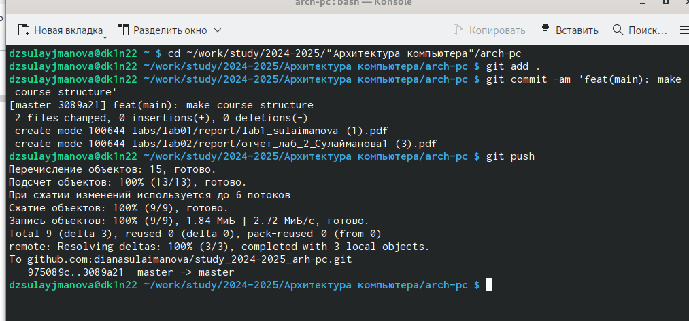

---
## Front matter
title: "Лабораторная работа № 2"
subtitle: "Система контроля версий Git"
author: "Сулайманова Диана Жоргошбаевна"

## Generic otions
lang: ru-RU
toc-title: "Содержание"

## Bibliography
bibliography: bib/cite.bib
csl: pandoc/csl/gost-r-7-0-5-2008-numeric.csl

## Pdf output format
toc: true # Table of contents
toc-depth: 2
lof: true # List of figures
lot: true # List of tables
fontsize: 12pt
linestretch: 1.5
papersize: a4
documentclass: scrreprt
## I18n polyglossia
polyglossia-lang:
  name: russian
  options:
	- spelling=modern
	- babelshorthands=true
polyglossia-otherlangs:
  name: english
## I18n babel
babel-lang: russian
babel-otherlangs: english
## Fonts
mainfont: IBM Plex Serif
romanfont: IBM Plex Serif
sansfont: IBM Plex Sans
monofont: IBM Plex Mono
mathfont: STIX Two Math
mainfontoptions: Ligatures=Common,Ligatures=TeX,Scale=0.94
romanfontoptions: Ligatures=Common,Ligatures=TeX,Scale=0.94
sansfontoptions: Ligatures=Common,Ligatures=TeX,Scale=MatchLowercase,Scale=0.94
monofontoptions: Scale=MatchLowercase,Scale=0.94,FakeStretch=0.9
mathfontoptions:
## Biblatex
biblatex: true
biblio-style: "gost-numeric"
biblatexoptions:
  - parentracker=true
  - backend=biber
  - hyperref=auto
  - language=auto
  - autolang=other*
  - citestyle=gost-numeric
## Pandoc-crossref LaTeX customization
figureTitle: "Рис."
tableTitle: "Таблица"
listingTitle: "Листинг"
lofTitle: "Список иллюстраций"
lotTitle: "Список таблиц"
lolTitle: "Листинги"
## Misc options
indent: true
header-includes:
  - \usepackage{indentfirst}
  - \usepackage{float} # keep figures where there are in the text
  - \floatplacement{figure}{H} # keep figures where there are in the text
---

# Цель работы
1.Цель работы
Ознакомиться с работой Git, выполнить задания в соответствии с лабораторной
работы, а также составить отчет о выполненной работе.

# Задание
2.Задание
1) Изучить документацию приложенную к лабораторной работе
2) Настроить Гитхаб
3) Создать SSH ключ, а также рабочее пространство
4) Создание репозитория и настройка каталога курса
5) Выполнение заданий для самостоятельной работы

# Теоретическое введение
3.Теоретическое введение

: Основные команды Git

|    Имя каталога |    Описание                                                     |
|-----------------|-----------------------------------------------------------------|
| `git commit -am`| Сохранить все добавленные изменения и все измененные файлы      |
|`git checkout -b`| Создание новой ветки,базирующейся на текущей                    | 
|`git checkout`   | Переключение на некоторую ветку                                 |
|`git push origin`| Отправка изменений конкретной ветки в центральный репозиторий   |
|  `git merge`    | Слияние ветки с текущим деревом                                 |
| `git branch -D` | Принудительное удаление локальной ветки                         |
|`git push origin`| Удаление ветки с центрального репозитория                       |
|  `git init`     | Создание основного дерева репозитория                           |
|   `git pull `   | Получение обновлений текущего дерева из центрального репозитория|

# Выполнение лабораторной работы
 4.Выполнение лабораторной работы 
 
 В пункте 2.4.2 требуется сделать конфигурацию git (см рис.1)

{#fig:001 width=70%}

В пунктах 2.4.3 - 2.4.4 требуется создать SSH ключ и рабочее пространство(см.
рис.2)
В пунктах 2.4.5-2.4.6 требуется создать репозиторию курса и настроить каталог курса (см рис.2)

{#fig:001 width=70%}
создание ssh ключа (рис.2)
публичный ssh ключ (рис.2)
создание каталога для предмета (рис.2)

Клонирование репозитория (рис.3)

{#fig:002 width=70%}

 
 Удаление лишнего файла (рис.4)
 
 {#fig:003 width=70%}
 

 Использование команды make (рис.5)
 
 {#fig:004 width=70%}

В пункте 2.5 требуется выполнить ряд замостоятельных заданий:
1) Создать отчет по выполнению лабораторной работы в соответствующим
каталоге рабочего пространства
2) Скопировать отчеты по выполнению предыдущих лабораторных работ в
соответствующие каталоги созданного рабочего пространства
3) Загрузить файлы на гитхаб

{#fig:005 width=70%}

# Выводы
5. Вывод
В процессе выполнения работы, я ознакомился с git. Изучил ряд команд, а также подготовил рабочее пространство.

